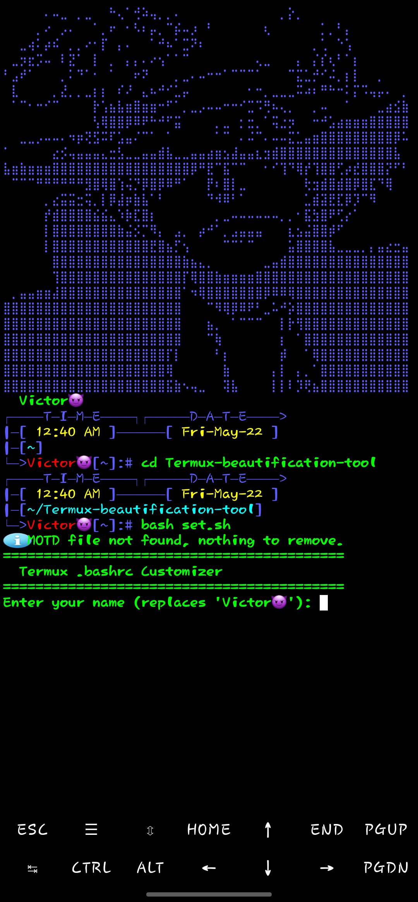

# Startup
## to get started copy this command and paste it in termux


``` bash

apt update
apt upgrade -y
pgk install git -y
git clone https://github.com/Anonymous-spy404/Termux-beautification-tool
cd Termux-beautification-tool
bash set.sh
```
## Paste your name where needed

## should look like this:

